# 🐚 Starting Launchers and Running Sessions
## Selecting and Starting Launchers
Click on your project and select one of the available **launchers** to create a new **session**. Note that each launcher has multiple configurations of CPUs/GPUs and memory, and that these vary by [software](storage_software.md#available-software).

Select your software, name the session, and choose the CPU/GPU and memory allocation (see our [guidance on choosing resoures](launchers_sessions.md#guidance-on-choosing-resources)) that is most appropriate for your work. Keep in mind that there are different [costs](billing.md#active-projects) associated with each configuration. **Starting a launcher for the first time can take 5-10 minutes.**

Once your session has been provisioned, click on "Connect" to open the software in your browser. 

### Starting Sessions
Once a launcher is provisioned, it will appear as one of your sessions at the top of your project space Workbench when you log into the RCP. Click on the "Start" button to re-start the session. It will take a few minutes to load, and then the "Connect" button will appear. Click on the "Connect" button to open the software in your browser.

 

### Stopping Sessions
If you have finished with your session, but plan to return to it, please ensure you have **stopped** it. The Stop option will appear after clicking on the hamburger menu to the right of the Connect button. Keeping the session running, even when you’re not actively using it, will incur charges, whereas a stopped session only incurs minor storage costs.

### Terminating Launchers
If you anticipate no longer needing a launcher, please **terminate** it. The Terminate option will appear after clicking on the hamburger menu to the right of the Start button of a stopped session. A terminated launcher will incur no costs. Keep in mind that once you terminate a launcher, downloaded packages (e.g., R packages) will be removed and unavailable for future use (i.e., if you restart a launcher you will need to recreate your environment).

# Guidance on Choosing Resources

Each launcher allows you to select a combination of **CPUs**/**GPUs**, and **memory (RAM)**. Choosing the right configuration helps you balance performance and cost. Use the guidance below to choose settings that match your workload and budget. 

## Memory (RAM)

> [!WARNING]
> **Please note that currently when a job on RCP runs out of memory, it stops but does not produce an error message to the user. RCS/IT is aware of this issue and working on improvements.**

A helpful rule of thumb is:

### **Request RAM that is approximately 4–10× the size of your dataset.**

### Why?
- Text files like CSVs expand significantly when loaded into memory — sometimes up to **10×** their on‑disk size.  
- Binary formats (RDS, Parquet, Feather, Arrow, `.fst`) expand only **1.2–1.5×**.  
- Best practices recommend avoiding both under‑ and over‑provisioning.

### Practical Tips
- If your workflow runs successfully on your local computer, start with a similar RAM or less (for example, if your laptop has 8GB of RAM, try asking for 8GB).
- For CSVs, assume **10× expansion** when loaded into memory.  
- For binary formats, assume **1.2–1.5× expansion**.  
- Convert CSVs to binary formats to reduce RAM usage and improve load times.  
- If you know your past memory usage, request that amount plus **20% overhead** to avoid crashes.

## CPUs and GPUs

### CPUs
A **CPU** handles general-purpose computation. Most tools such as R, Python, Stata, Spyder, and MATLAB use **one CPU by default** unless explicitly parallelized.

### GPUs
A **GPU** accelerates massively parallel operations and is useful only when your code uses GPU-enabled libraries, such as:

- TensorFlow, PyTorch, or JAX  
- CUDA-enabled simulation frameworks  
- Transformer-based NLP models  
- Large-scale deep learning workloads  

If your code is *not* GPU-enabled, a GPU instance will be **more expensive** and often **slower** than a CPU-only configuration.

## Quick Tips for Choosing CPUs

- **Use 1 CPU for almost all interactive work**, including R, Python, Stata, Spyder, and Jupyter notebooks.  
- Choose **2+ CPUs only when your code is explicitly parallel-aware**, such as:
  - Python: `multiprocessing`, `joblib`, `ray`, PyTorch DataLoader
  - R: `future`, `parallel`, `data.table` multithreading
  - MATLAB: Parallel Computing Toolbox
  - Stata: limited multiprocessor support via `set processors`  
- More CPUs do **not** improve performance unless your code is parallelized.  
- Large CPU allocations should be used for **short intensive jobs**, not long-running sessions sitting idle.

## Quick Tips for Choosing GPUs

### Use a GPU if:
- You are training neural networks  
- You are working with transformer-based NLP models  
- You are performing large-scale tensor operations  
- Your code uses CUDA or GPU-enabled libraries  

### Do *not* use a GPU if:
- You are performing regression, modeling, or typical statistical tasks  
- You are cleaning data or visualizing  
- You are working in R or Stata without GPU packages  
- You are not intentionally using deep learning libraries  

## Recommended Configurations (with Cost Impact)

### Cost Impact Legend

- 💲 = Low cost  
- 💲💲 = Moderate cost  
- 💲💲💲 = High cost  
- 💲💲💲💲 = Very high cost  

| Use Case | Recommended Config | Example Launcher | Cost Impact | Notes |
|----------|-------------------|------------------|-------------|-------|
| Light interactive work (R/Python/Stata) | 1–2 CPUs, 4–8 GB RAM | Medium General Purpose (2 CPU / 4 GB) | 💲 | Good for small datasets and exploration. |
| Medium analysis (2–10 GB CSV) | 1 CPU, 16–32 GB RAM | Memory-Optimized Large (2 CPU / 16 GB) | 💲💲 | CSV expands significantly; convert to binary formats. |
| Heavy analysis (10–30 GB CSV) | 1–2 CPUs, 32–64 GB RAM | Memory-Optimized XL (4 CPU / 32 GB) | 💲💲💲 | Suitable for large merges and joins. |
| Large binary datasets (10–50 GB) | 1–2 CPUs, 16–32 GB RAM | Extra-Large General Purpose (8 CPU / 32 GB) | 💲💲💲 | Binary formats reduce RAM needs. |
| Stata large merges | 1–2 CPUs, 16–32 GB RAM | Stata Large General Purpose (4 CPU / 16 GB) | 💲💲 | Stata benefits from modest multiprocessor usage. |
| Parallel simulation | 2–8 CPUs, 8–16 GB RAM | Compute-Optimized Large (8 CPU / 16 GB) | 💲💲💲 | Only useful if your code is parallelized. |
| Classical ML (sklearn/caret) | 2–4 CPUs, 8–16 GB RAM | Large General Purpose (2 CPU / 8 GB) | 💲💲 | Most classical ML does not need GPUs. |
| Deep learning training | 4 CPU, 16–32 GB RAM, GPU | Accelerated ML Instance (4 CPU / 16 GB GPU) | 💲💲💲💲 | Recommended for neural networks. |
| Heavy NLP (transformers) | 4–8 CPU, 16–64 GB RAM, GPU | ml.g4dn.xlarge or similar | 💲💲💲💲 | GPU strongly recommended. |
| Enterprise-scale DL | 48 CPU, 192 GB RAM, GPU | g6extralarge GPU instance | 💲💲💲💲 | Only for extremely large workloads. |

## Resource Chooser Flowchart

```mermaid
flowchart TD

    %% Start
    A[What type of work are you doing?] --> B[Data analysis]
    A --> C[Simulation]
    A --> D[Machine learning]

    %% Data analysis branch
    B --> B1[How big is your dataset?]

    B1 --> B1a[< 2 GB]
    B1 --> B1b[2–10 GB]
    B1 --> B1c[10–30 GB]

    B1a --> BA[RAM 4–8 GB, 1 CPU]
    B1b --> BB[RAM 8–16 GB, 1 CPU]
    B1c --> BC[RAM 32–64 GB, 1–2 CPUs]

    BA --> BEnd[CSV needs 4–10x RAM; binary needs ~1.2x]
    BB --> BEnd
    BC --> BEnd

    %% Simulation branch
    C --> C1[Is your code parallel-aware?]

    C1 --> C2a[Yes]
    C1 --> C2b[No]

    C2a --> CA[Use 2–8 CPUs, RAM 8–32 GB]
    C2b --> CB[Use 1 CPU, RAM 4–16 GB]

    CA --> CEnd[Only scale CPUs if you wrote parallel code]
    CB --> CEnd

    %% Machine learning branch
    D --> D1[Using GPU-enabled libraries?]

    D1 --> D1a[Yes]
    D1 --> D1b[No]

    D1a --> DA[Use GPU: RAM 16–64 GB]
    D1b --> DB[Use CPU: RAM 8–32 GB]

    DA --> DEnd[GPU recommended for NN and transformers]
    DB --> DEnd

    %% Final guidance
    BEnd --> Z[1 CPU is enough unless your code is parallel]
    CEnd --> Z
    DEnd --> Z
```

